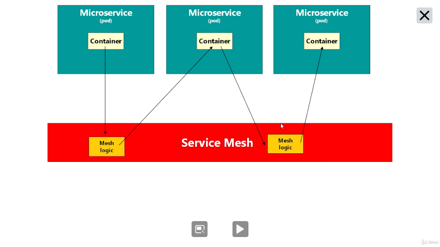
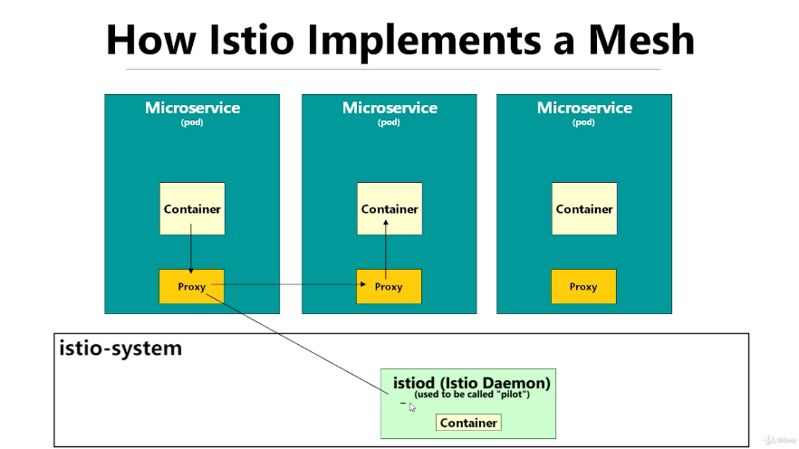

# Introduction

## What is Istio ?
---

Istio is a `Service Mesh`, in other words, is a configurable, low‑latency infrastructure layer designed to handle a high volume of network‑based interprocess communication among application infrastructure services. Provisioning telemetry, security, tracing and observability.

## How Istio Implements Service Mesh ?
---

Istio implements its service mesh using proxies.

Proxies run alongside with the containers intercepting the requests and routing the requests (applying the mesh logic). Also, for each request the proxy send data to the `istiod` (istio daemon), most of Istio features is implemented on istiod. Including the telemetry feature.

## Istio Concepts
---

- `Data Plane` - References to all Istio`s Proxies that istio injects in the system.

- `Control Plane` - Pods that run on Istiod, in other words, pods that implement istio features.