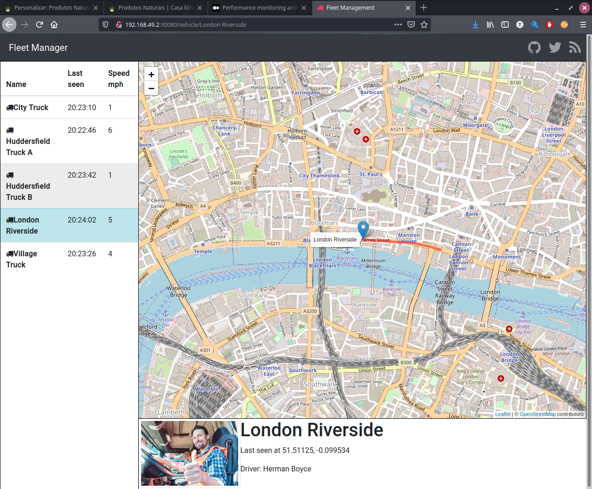
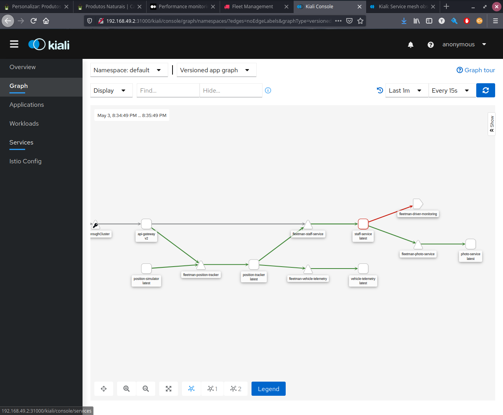
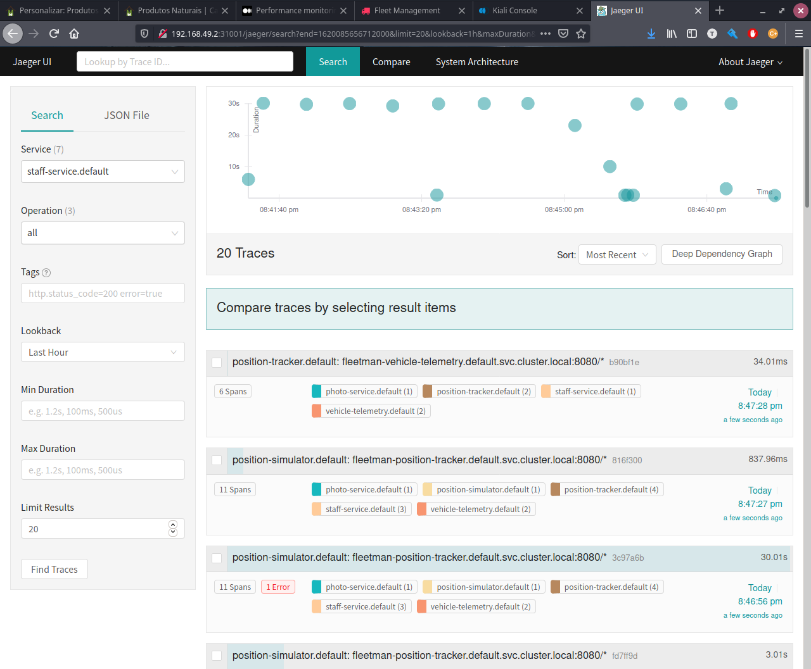

# Getting Started

## Installing Minikube
---

- `Installing Kubectl`

```bash
curl -LO "https://dl.k8s.io/release/$(curl -L -s https://dl.k8s.io/release/stable.txt)/bin/linux/amd64/kubectl"

sudo install -o root -g root -m 0755 kubectl /usr/local/bin/kubectl
```

- `Installing Minikube`
```bash

sudo mkdir -p /usr/local/bin/
sudo install minikube /usr/local/bin/

minikube start --memory 4096
```

## Installing Istio
---

```bash
kubectl apply -f data/warmup-exercise/1-istio-init.yaml 
kubectl apply -f data/warmup-exercise/2-istio-minikube.yaml
# Configuring Kiali Secret
kubectl apply -f data/warmup-exercise/3-kiali-secret.yaml
```

## Deploying a Demo Application
---
```bash
# Activates the automatic injection of istio sidecar
kubectl label namespace default istio-injection=enabled
kubectl apply -f data/warmup-exercise/4-application-full-stack.yaml
```

## Accessing the Application
---
```bash
minikube ip
```

With the result of minikube'ip access the port 30080. `http:${minikube-ip}:30080`



## Debuging Application
---

- `Kiali` - Service Mesh Observability and Configuration

This service helps to show how services are connected and how they are performing. It is possible to access it through: `http:${minikube-ip}:31000`.



- `Jaeger` - Service Tracing

This service allows to investigate the request steps (traces). It is possible to access it through: `http:${minikube-ip}:31001`.

