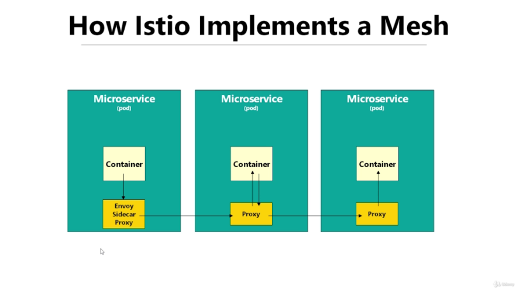

# Envoy

The proxy part of Istio is implemented by an open source project called `Envoy`.

Envoy is a C++ proxy for cluster based applications, being a high performance server with a small memory footprint. Offering: 

- HTTP/2 and GRPC Support
- Advanced Load Balancing (Circuit Breaking, Shadowing etc)
- Observability (Tracing)

## References
---

- [`Envoy`](https://www.envoyproxy.io/)