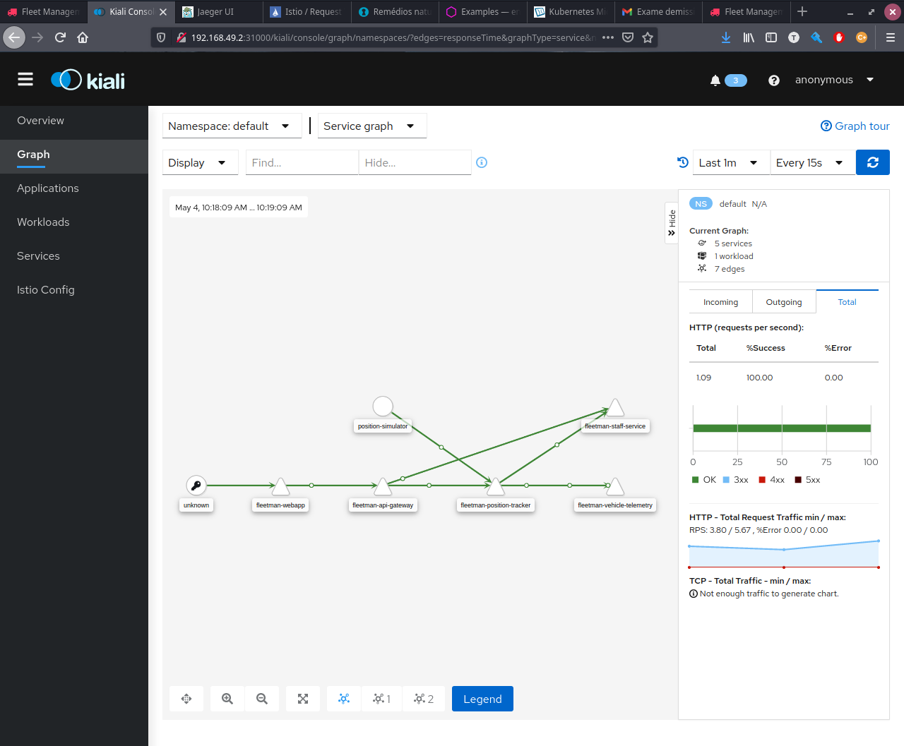
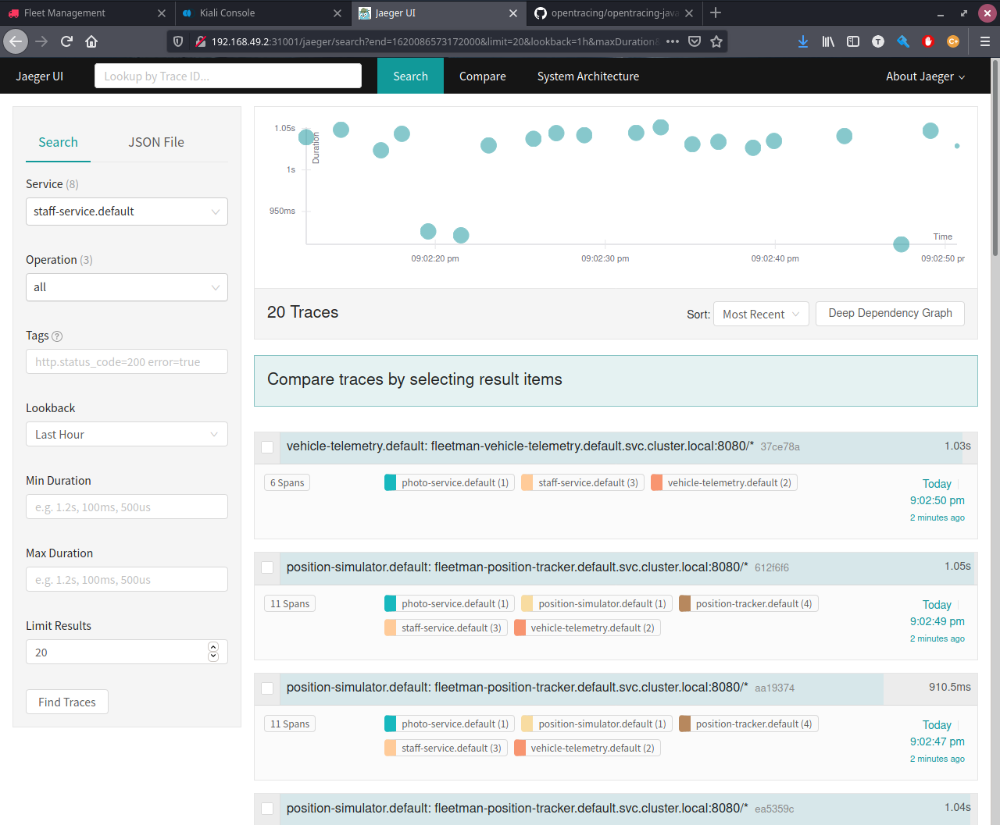
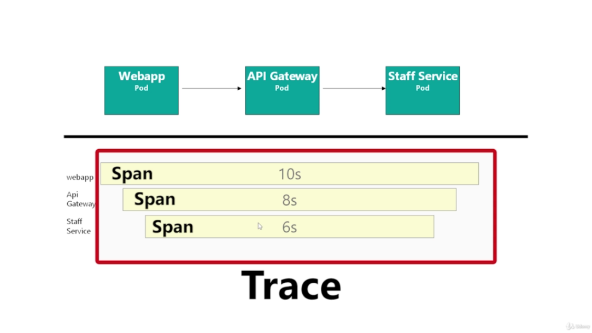
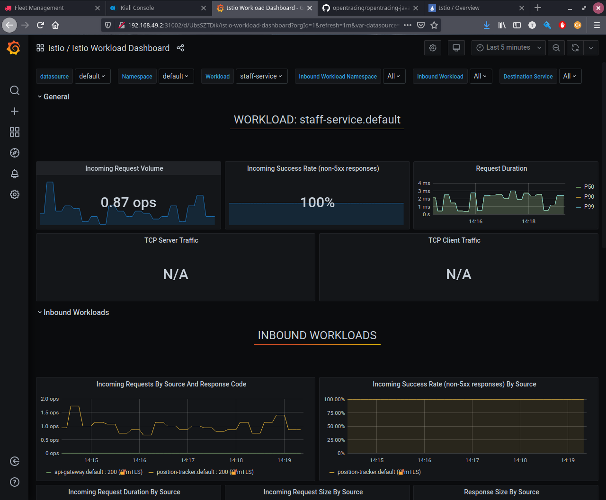

# Telemetry

Istio is shipped with 3 amazing tool to provide observability and monitoring:

- `Kiali` - Network Data

- `Jaeger` - Tracing Data

- `Grafana` - Metrics Data

## Telemetry Requirements
---

- `Envoy` - on each pod desired to monitor.
- `Control Plane` - So, it is necessary to run `istiod`,  `kiali`, `jaeger` and `grafana`

No specific Istio yaml configuration is required ( Virtual Services, Gateways etc ).

## Setup the Demo
---

```bash
kubectl apply -f ./data/1\ Telemetry/1-istio-init.yaml
kubectl apply -f ./data/1\ Telemetry/2-istio-minikube.yaml
kubectl apply -f ./data/1\ Telemetry/3-kiali-secret.yaml
kubectl apply -f ./data/1\ Telemetry/4-label-default-namespace.yaml
kubectl apply -f ./data/1\ Telemetry/5-application-no-istio.yaml

```

After that, it is possible to access the application by the following address: `$(minikube ip):30080`

## Kiali
---

Used to visualize relationships between services, also provides information about requests, health, status code, traffic etc.

Kiali can access on the following address: `$(minikube ip):31000`



Another amazing feature that Kiali provides, is the hability of editing traffic rules on its screen. For example it is possible to suspend all traffic from a service (in case of an emergency).


## Jaeger
---

Jaeger is a distributed tracing framework intregrated in istio making using of its telemetry. The main reason of Jaeger is to provide hability to investigate a request breaking its chain into steps and be able to analyse each of these steps and how they interact with each other.

It can be access on the following address: `$(minikube ip):31001`



Distributed Logs Concepts:

- `Trace` - Is the execution path through a distributed system and is composed by one or more spans.
- `Span` - Represents one microservice in the execution path.



### `Required Configurations To Tracing Work`

To allow istio tracing work correctly, it is necessary to foward the original requests headers through the request chain.

The required headers are:

    x-request-id
    x-b3-traceid
    x-b3-spanid
    x-b3-parentspanid
    x-b3-sampled
    x-b3-flags
    x-ot-span-context

## Grafana
---

Grafana is a popular open source graphing framework. And can be accessed on the following address: `$(minikube ip):31002` 



Istio automatically creates dashboards:

- `Service Dashboard` - Data about the application Services.

- `Workload Dashboard` - Data about the application workload (pods).

- `Control Pane`- Data about IstioD, it is a low level dashboard.

- `Performance Dashboard` - Data about istio performance, in case of problems with too much istio memory/cpu/disk consumption.

- `Mesh Dashboard` - Provides a top level view about what is happening in the entire architecture.

- `Wasm Dashboard` - A very advanced istio feature, used for extension of its capabilities.

## References
---

- [`Open Tracing Project`](https://opentracing.io/) - The goal is to build a neutral vendor API for distributed tracing.

- [`Istio Tracing Propagation`](https://istio.io/latest/docs/tasks/observability/distributed-tracing/overview/)