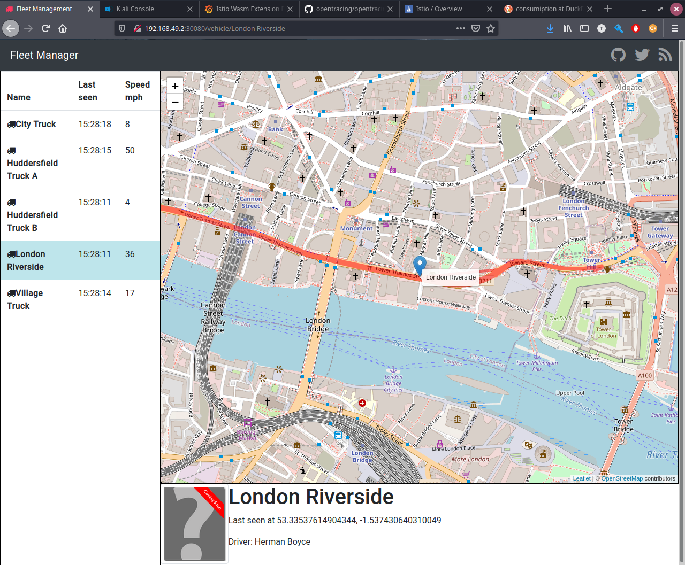
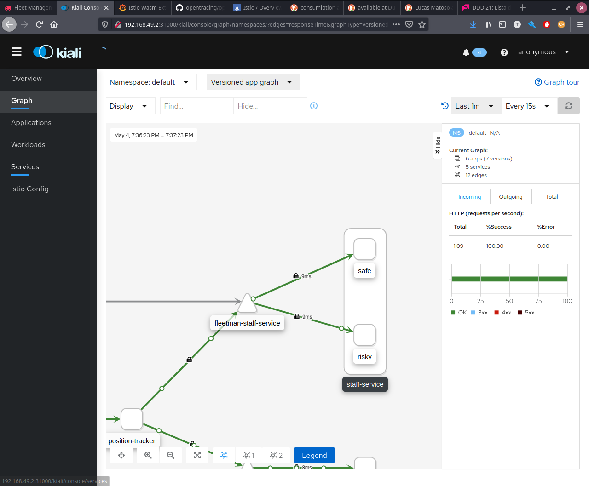
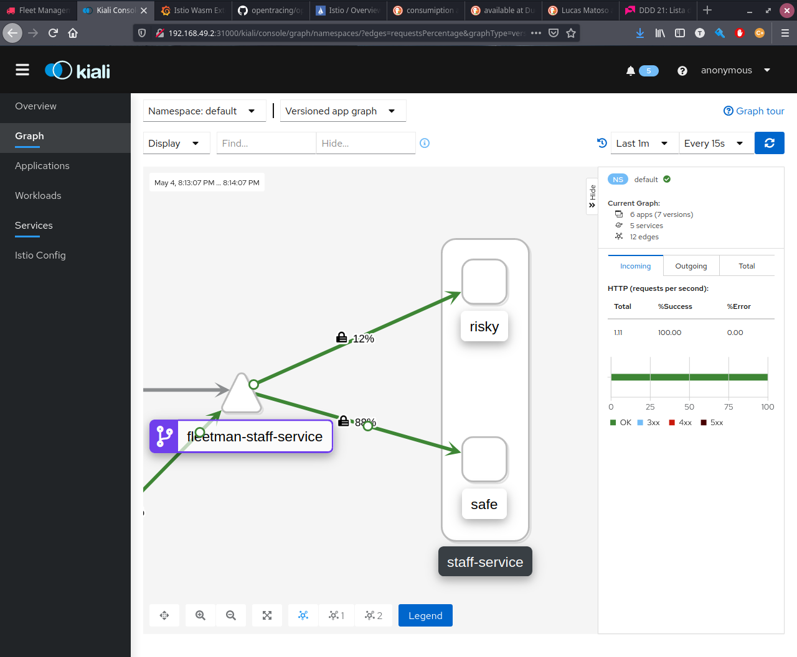
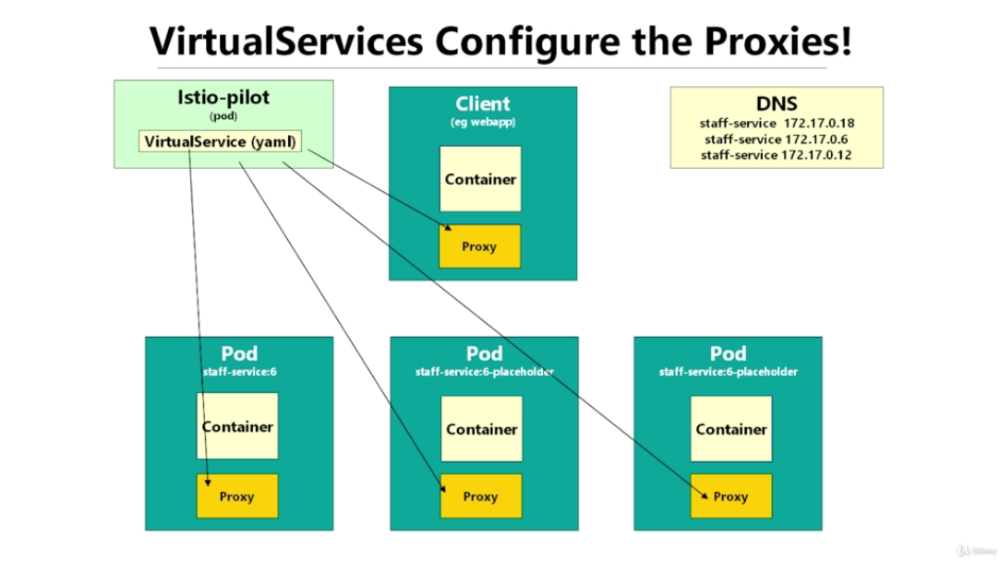
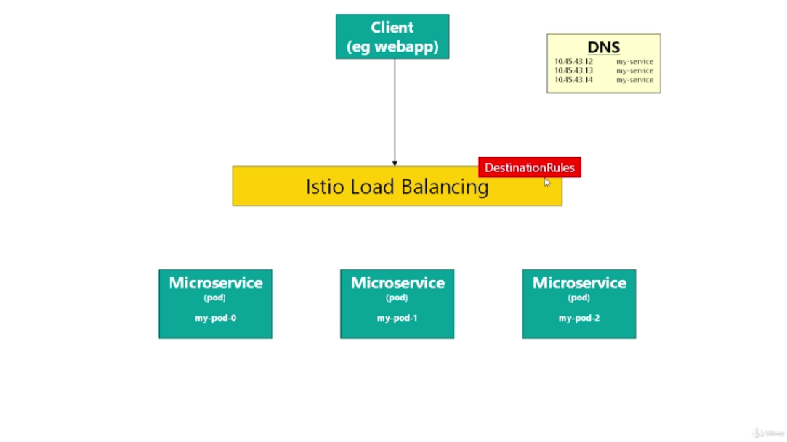
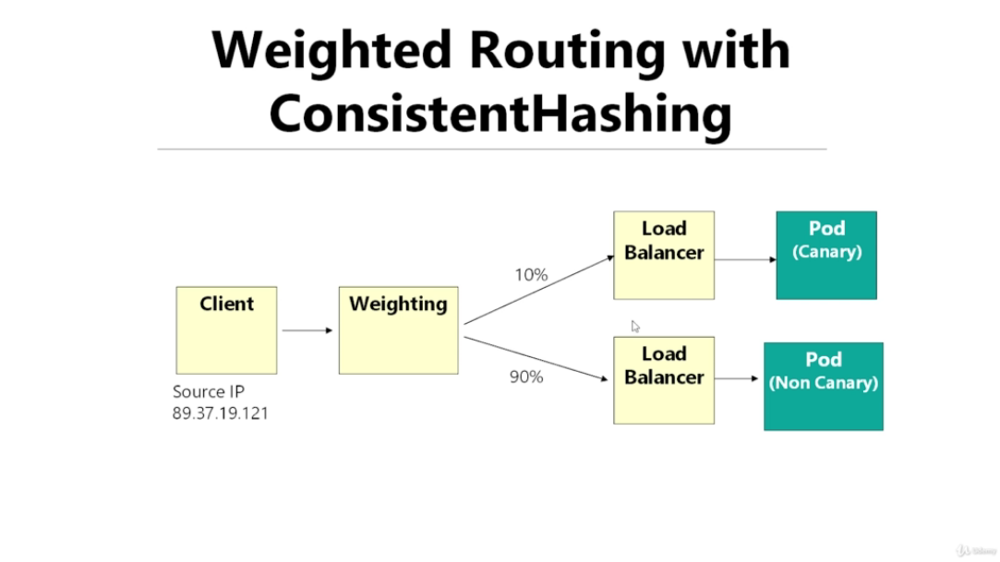

# Traffic Management

Istio is packaged with a lot of features that provides control the traffic inside the cluster. Allowing to perform Canaries Releases, Dark Releases and much more.

## Setup the Demo
---

```bash
kubectl apply -f ./data/2\ Traffic\ -\ Starting\ Files/1-istio-init.yaml
kubectl apply -f ./data/2\ Traffic\ -\ Starting\ Files/2-istio-minikube.yaml
kubectl apply -f ./data/2\ Traffic\ -\ Starting\ Files/3-kiali-secret.yaml
kubectl apply -f ./data/2\ Traffic\ -\ Starting\ Files/4-label-default-namespace.yaml
kubectl apply -f ./data/2\ Traffic\ -\ Starting\ Files/5-application-no-istio.yaml
```

```yaml
# Adding new Feature to the Demo
# Editing ./data/2\ Traffic\ -\ Starting\ Files/5-application-no-istio.yaml

# changing the image of Deployment staff-service
# from richardchesterwood/istio-fleetman-staff-service:6
# to richardchesterwood/istio-fleetman-staff-service:6-placeholder
apiVersion: apps/v1
kind: Deployment
metadata:
  name: staff-service
spec:
  selector:
    matchLabels:
      app: staff-service
  replicas: 1
  template:
    metadata:
      labels:
        app: staff-service
        version: safe # <-- modified
    spec:
      containers:
      - name: staff-service
        image: richardchesterwood/istio-fleetman-staff-service:6-placeholder # <-- modified
        env:
        - name: SPRING_PROFILES_ACTIVE
          value: production-microservice
        imagePullPolicy: Always
        ports:
        - containerPort: 8080
```

```bash
 kubectl apply -f ./data/2\ Traffic\ -\ Starting\ Files/5-application-no-istio.yaml 
```

So now, we have a new version on the system which have a placeholder on the truck driver`s photo.



And a new release will be lanched to update de placeholder with the truck driver's photo. And for any reason, it is considered a `risky release`.

A good approach to deal with the situation is a `Canary Release`.

## Canary Release
---

The idea of the canary release is to deploy a new version of software (that is considered risky). And just make it available "live" for a percentage of the time.

So, both versions (the old and the new one) will be `live` alonside with each other. However the old version will be hit most of time.

Thus, the `risky` of a bad deploy is reduced.

### `Setting Up the Canary Release`

- `Deploy a New Deployment of Staff Service with the Image`
```yaml
---
apiVersion: apps/v1
kind: Deployment
metadata:
  name: staff-service-risky-version
spec:
  selector:
    matchLabels:
      app: staff-service
  replicas: 1
  template: # template for the pods
    metadata:
      labels:
        app: staff-service
        version: risky # <-- Modified 
    spec:
      containers:
      - name: staff-service
        image: richardchesterwood/istio-fleetman-staff-service:6 # <-- Modified with the new risky image
        env:
        - name: SPRING_PROFILES_ACTIVE
          value: production-microservice
        imagePullPolicy: Always
        ports:
        - containerPort: 8080
```

- `Apply the release`
```ssh
kubectl apply -f ./data/2\ Traffic\ -\ Starting\ Files/5-application-no-istio.yaml
```

This is the new result in Kiali, however Istio Canary Release was not configured yet. It is just K8's default behaviour doing a `Bad Canary Release` (splitting the traffic 50/50).



- `Configuring Istio Canary Release` - Splits Traffic on 90/10 proportion, 90% for the old one and 10% for the new one.
```yaml
kind: VirtualService
apiVersion: networking.istio.io/v1alpha3
metadata:
  name: fleetman-staff-service # <-- Custom Name / Can be anything
spec:
  hosts:
    - fleetman-staff-service.default.svc.cluster.local # <-- K8`s Service DNS Name
  http:
    - route:
        - destination:
            host: fleetman-staff-service.default.svc.cluster.local # <-- Target DNS Name
            subset: safe # <-- Name defined in Destination Rule
          weight: 90
        - destination:
            host: fleetman-staff-service.default.svc.cluster.local # <-- Target DNS Name
            subset: risky
          weight: 10
---
kind: DestinationRule # <-- Defining which pods should be part of each subset
apiVersion: networking.istio.io/v1alpha3
metadata:
  name: fleetman-staff-service # <-- Custom Name / Can be anything
spec:
  host: fleetman-staff-service.default.svc.cluster.local # <-- K8`s Service DNS Name
  subsets:
    - labels: # <-- This is a selector
        version: safe # find pods with label "safe"
      name: safe # <-- Group Name used on Virtual Service
    - labels:
        version: risky
      name: risky
```



## What's Virtual Service ? 
---

The Virtual Service is a way to configure custom routing rules to the service mesh.



### `Istio Virtual Service vs Kubernetes Service`

A good way to understand it is:

- `K8's Service` - Configures DNS - A way that K8's uses to discover the IP addresses of individual pods (Service Discovery).

- `Istio Virtual Service` - Configures the proxies (envoys) dinamically and with that, configuring custom routings. It does not replace K8's Service.

## What's Destination Rule ? 
---

Destination Rule is a way that Istio uses to define subsets between pods, in other words, to divide which group of pods are running the old version and which group of pods are running the new version.



## What about a Sticky Canary Release ?
---

In a real world project it is always a good practice when working with a canary release that if an user got the canary release he should sticky with it during all his experience. And the same applies with the non canary version.

Istio implements `session affinity` or `stickiness` on its loadbalances, specifically on `Destination Rules`. Something like this:

```yaml
kind: DestinationRule
apiVersion: networking.istio.io/v1alpha3
metadata:
  name: fleetman-staff-service 
spec:
  subsets:
    - labels:
        version: safe
      name: safe
    - labels:
        version: risky
      name: risky
  trafficPolicy:
    loadBalancer:
      consistentHash:
        useSourceIp: true
```

However, this approch `does not work! ` with the weighted routes (Canary Releases). Unfortunatelly the weighted routes are evaluated before the request reach the Destination Rules. So it is not possible to make a Sticky Canary Release for now.



Thus, it is possible to use this feature to implement some sort of caching in the subset. For example in case of a heavy computation, and it is necessary to improve performance. That way a cache could be saved on a specific pod and all request for a particular user will be redirect to that pod. However, never use this approch to keep a session.

## References
---

- [`Virtual Service Options`](https://istio.io/latest/docs/reference/config/networking/virtual-service/)

- [`Destination Rules Options`](https://istio.io/latest/docs/reference/config/networking/destination-rule/)