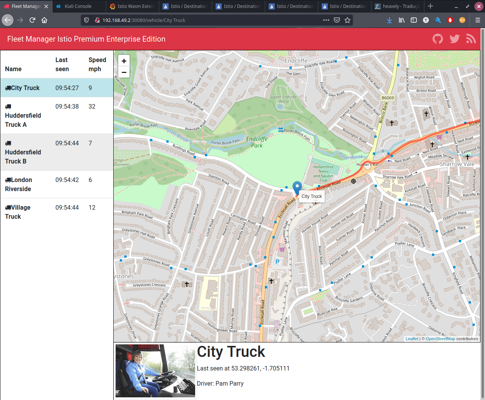
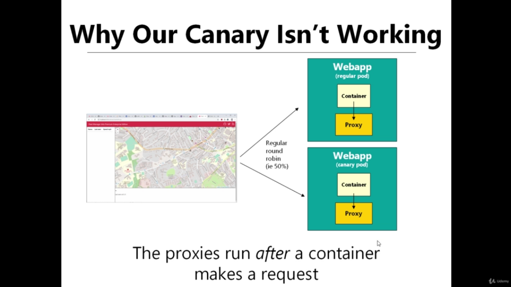
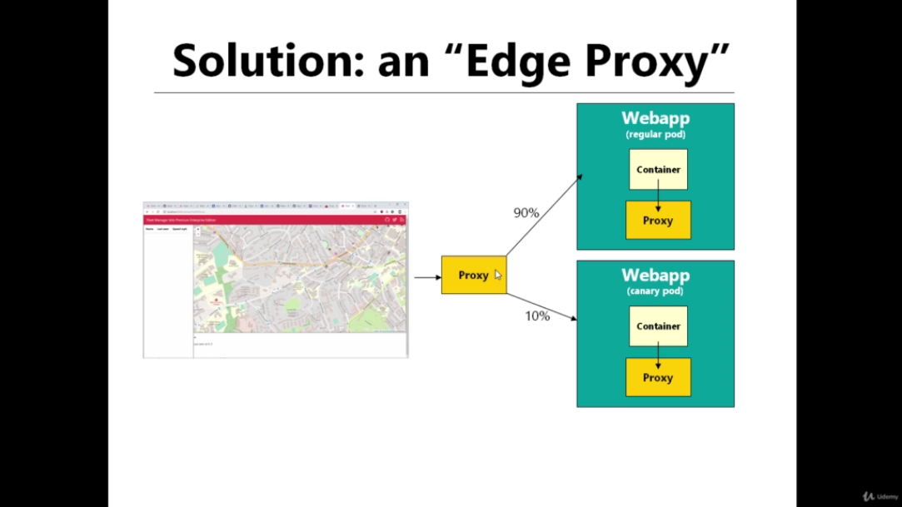
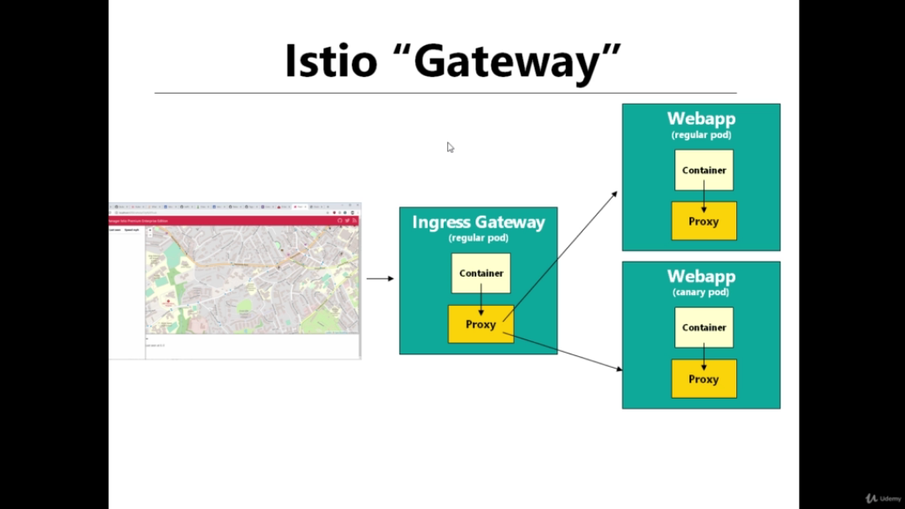
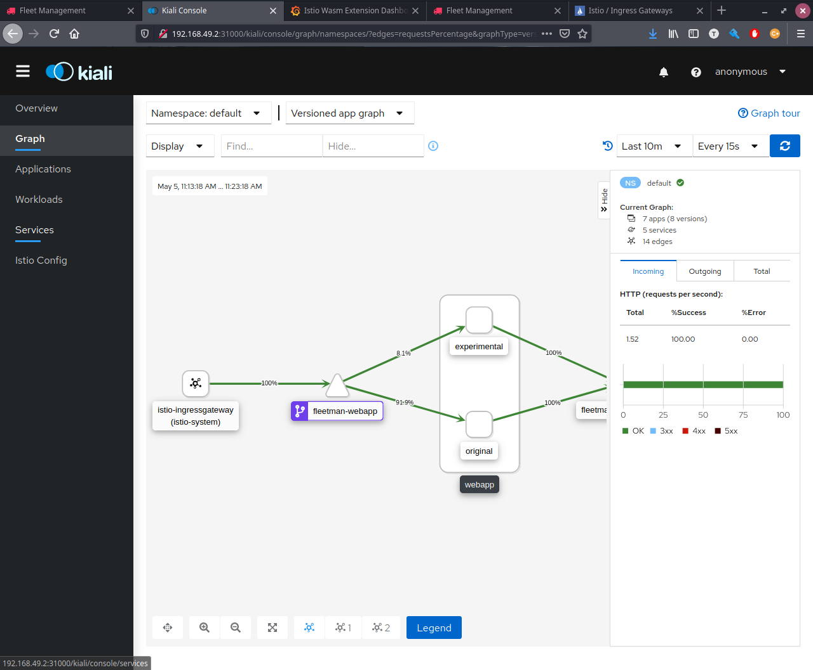

# Gateways

Istio Gateway is used to specify services that should be exposed outside the cluster. And it is a better approach and a replacement for Kubernets Ingress Gateway. Since it features monitoring and route rules can be applied to traffic entering the cluster.

## Setup Demo
---
```bash
kubectl apply -f ./data/3\ Gateways/1-istio-init.yaml
kubectl apply -f ./data/3\ Gateways/2-istio-minikube.yaml
kubectl apply -f ./data/3\ Gateways/3-kiali-secret.yaml
kubectl apply -f ./data/3\ Gateways/4-label-default-namespace.yaml
kubectl apply -f ./data/3\ Gateways/5-application-no-istio.yaml
```

## Canary Release on FrontEnd
---

Now, there is a requirement to deploy an experimental version of the frontend (Canary Release). For that, lets perform the following modifications:

- `Edit the FrontEnd Deployment`

```yaml
apiVersion: apps/v1
kind: Deployment
metadata:
  name: webapp
spec:
  selector:
    matchLabels:
      app: webapp
      version: original # <-- Modified
  replicas: 1
  template: # template for the pods
    metadata:
      labels:
        app: webapp
        version: original
    spec:
      containers:
      - name: webapp
        image: richardchesterwood/istio-fleetman-webapp-angular:6
        env:
        - name: SPRING_PROFILES_ACTIVE
          value: production-microservice
        imagePullPolicy: Always
---
# All Lines Below was Duplicated from prior webapp deployment
apiVersion: apps/v1
kind: Deployment
metadata:
  name: webapp-experimental # <-- Modified
spec:
  selector:
    matchLabels:
      app: webapp
  replicas: 1
  template: # template for the pods
    metadata:
      labels:
        app: webapp
        version: experimental # <--Modified
    spec:
      containers:
      - name: webapp
        image: richardchesterwood/istio-fleetman-webapp-angular:6-experimental # <-- Modified
        env:
        - name: SPRING_PROFILES_ACTIVE
          value: production-microservice
        imagePullPolicy: Always

# Apply It ! 
```

The result is the standard Kubernets splitting the traffic 50/50 between the original version and the experimental version. That is the experimental version with a red banner.




- `Configure Istio to do a Canary Release`
```yaml
kind: VirtualService
apiVersion: networking.istio.io/v1alpha3
metadata:
  name: fleetman-webapp
spec:
  hosts:
    - fleetman-webapp.default.svc.cluster.local
  http:
    - route:
        - destination:
            host: fleetman-webapp.default.svc.cluster.local
            subset: original
          weight: 90
        - destination:
            host: fleetman-webapp.default.svc.cluster.local
            subset: experimental
          weight: 10
---
kind: DestinationRule
apiVersion: networking.istio.io/v1alpha3
metadata:
  name: fleetman-webapp
spec:
  host: fleetman-webapp.default.svc.cluster.local
  subsets:
    - labels:
        version: original
      name: original
    - labels:
        version: experimental
      name: experimental

```

However, after the deploy the Canary 90/10 will not work, since now we are working on a frontend and the request is not being chain between the proxies. In other words,the `**proxies just run after**` a container makes a request. In the case of a frontend, the frontend container never performs a request, it just answers the request it received. So the request never touches the proxies.



The solution is configure a `Edge Proxy` that will sit in front of the cluster, intercepting all the incomming requests.



In the Istio way, it is necessary to configure a `Gateway`



- `Configuring Gateway`
```yaml
apiVersion: networking.istio.io/v1alpha3
kind: Gateway
metadata:
  name: ingress-gateway-configuration # <-- This is a custom name / can be anything
spec:
  selector:
    istio: ingressgateway # <-- This is a label selector
  servers:
  - port:
      number: 80 # <-- Port that will be allowed
      name: http
      protocol: HTTP # <-- Protocal that will be allowed
    hosts:
    - "*" # <-- Hosts (Domain Name) that will be allowed
```

Now, it is necessary to reconfigure the virtual service to link the Gateway with the Virtual Service, and also allowing its hosts.

- `Reconfiguring the Virtual Service`
```yaml
kind: VirtualService
apiVersion: networking.istio.io/v1alpha3
metadata:
  name: fleetman-webapp
spec:
  hosts:
    # - fleetman-webapp.default.svc.cluster.local
    # fleetman-webapp was remove because  the wildcard "*" already contains it
    - "*" # <-- also, it is necessary to copy the hosts of the gateway. usually it will be the domain name
  gateways: 
    - ingress-gateway-configuration # <-- Links the Gateway with the Virtual Service
  http:
    - route:
        - destination:
            host: fleetman-webapp.default.svc.cluster.local
            subset: original
          weight: 90
        - destination:
            host: fleetman-webapp.default.svc.cluster.local
            subset: experimental
          weight: 10

# Apply It
``` 

Now accessing the WebApp through the Istio Ingress Gateway on the address `${minikube ip}:31380` everything should work, including the WebApp Canary Release Proportion.

And the result on Kiali will be:



## Routing Based on Prefixes
---

On Virtual Service is also possible to configure routes based on the prefix of a URI. For example:

```yaml
kind: VirtualService
apiVersion: networking.istio.io/v1alpha3
metadata:
  name: fleetman-webapp
spec:
  hosts:
    - "*" 
  gateways: 
    - ingress-gateway-configuration
  http:
    - match:
      - uri: # IF
          prefix: "/experimental"
      - uri: # OR
          prefix: "/canary"
      route: # THEN
      - destination:
            host: fleetman-webapp.default.svc.cluster.local
            subset: experimental

    - match:
      - uri: # IF
          prefix: "/"
      route: # THEN
      - destination:
            host: fleetman-webapp.default.svc.cluster.local
            subset: original
``` 

## Routing Based on Subdomain
---

On Virtual Service is also possible to configure routes based on the Subdomain. But first will be necessary to configuring the local hosts on the machine, since we do not own a custom domain name

- `Edit /etc/hosts`

``` bash
echo "192.168.49.2 fleetman.com" >> /etc/hosts
echo "192.168.49.2 experimental.fleetman.com" >> /etc/hosts
```
- `Istio Configuration`

```yaml
apiVersion: networking.istio.io/v1alpha3
kind: Gateway
metadata:
  name: ingress-gateway-configuration
spec:
  selector:
    istio: ingressgateway # use Istio default gateway implementation
  servers:
  - port:
      number: 80
      name: http
      protocol: HTTP
    hosts: # <-- Allowing just custom domain name
    - "*.fleetman.com"   # Domain name of the external website
    - "fleetman.com"
---
kind: VirtualService
apiVersion: networking.istio.io/v1alpha3
metadata:
  name: fleetman-webapp
  namespace: default
spec:
  hosts: 
    - "fleetman.com"
  gateways:
    - ingress-gateway-configuration
  http:
    - route:
      - destination:
          host: fleetman-webapp
          subset: original
---
kind: VirtualService
apiVersion: networking.istio.io/v1alpha3
metadata:
  name: fleetman-webapp-experiment
  namespace: default
spec:
  hosts: 
    - "experimental.fleetman.com"
  gateways:
    - ingress-gateway-configuration
  http:
      - route:
        - destination:
            host: fleetman-webapp
            subset: experimental
---
kind: DestinationRule
apiVersion: networking.istio.io/v1alpha3
metadata:
  name: fleetman-webapp
  namespace: default
spec:
  host: fleetman-webapp
  subsets:
    - labels:
        version: original
      name: original
    - labels:
        version: experimental
      name: experimental

``` 