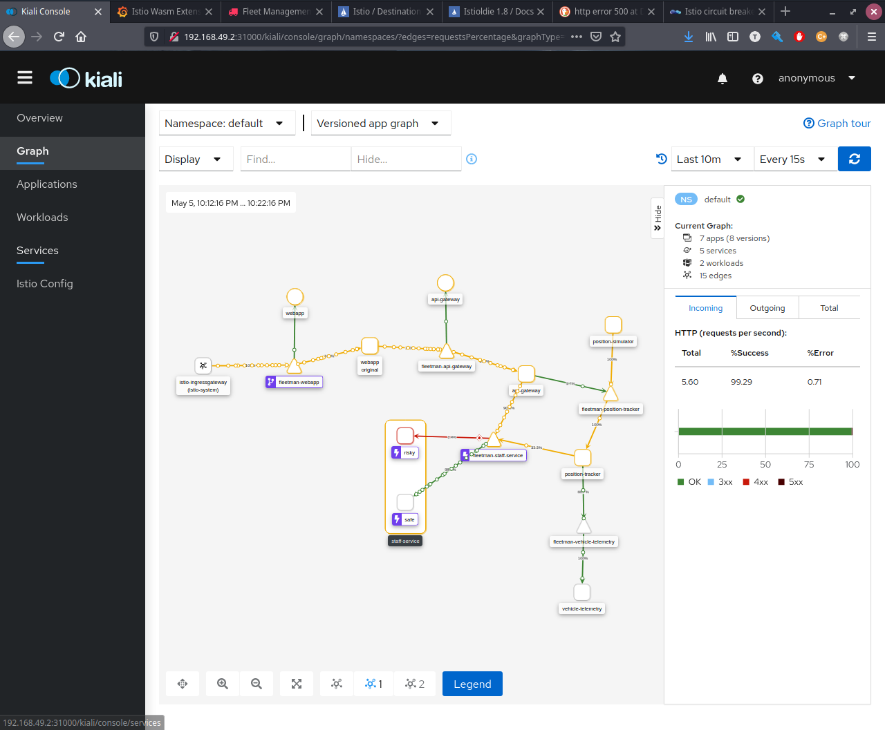

# Circuit Breaking

## Cascading Failure

Cascading Failure is a process that happen in a system of interconnected parts, like a microservices chain. So, when a microservice or a part of this chain started to fail, the fail is cascaded to all other connected services in the chain.


This is a system nightmare since a major part of the architecture goes down, the monitoring system goes berserk and is very, very hard to spot the root failure.

## Circuit Breaking
---

Circuit Breaking is a strategy to prevent a cascading failure on the entire system. The ideia is to put a piece of software inside the microservice request client that will monitore the success rate of the requests performed to other microservice. If the requests performed started to fail the circuit break will interrupt the requests (cutting the connection), avoiding a cascating failure and also given time to the degreded microservice to recover itself.


Istio provides a Circuit Break out of box with the proxy! 


## Setup the Demo
```bash
kubectl apply -f ./data/6\ Circuit\ Breaking/1-istio-init.yaml
kubectl apply -f ./data/6\ Circuit\ Breaking/2-istio-minikube.yaml 
kubectl apply -f ./data/6\ Circuit\ Breaking/3-kiali-secret.yaml
kubectl apply -f ./data/6\ Circuit\ Breaking/4-label-default-namespace.yaml
kubectl apply -f ./data/6\ Circuit\ Breaking/5-application-no-istio.yaml
```

So, in this demo one of the pods of the `service-staff` is poisoned with a bad code, specifically the risky version makes the resquest perform really bad, causing an error.


## Configure Circuit Breaker

Circuit Break or `Outlier Detection` is disabled by default, and need to be activated on `Destination Rules`.

And for a circuit break just is necessary Destination Rules, in other works, Virtual Services is not required for this task

```yaml
apiVersion: networking.istio.io/v1alpha3
kind: DestinationRule
metadata:
  name: staff-service-circuit-breaker # <-- Custom Name could be anything
spec:
  host: fleetman-staff-service.default.svc.cluster.local # <-- K8`s Service
  trafficPolicy:
    outlierDetection: # <-- Activates the Circuit Break
      consecutive5xxErrors: 5 # <-- How Many Errors allowed before circuit breaks triggers
      interval: 20s # <-- Time Period that Consecutive Errors applies to
      baseEjectionTime: 15m # <-- How long a problematic pod will be removed from loadbalancer
      maxEjectionPercent: 100 # <-- Max Percentage of pods that can be ejected from the loadbalancer

``` 

As a result,


So if a specific pod fails a request 3 times in a row the circuit break kicks in. For test it lets perform a while loop calling the poisoned service until the circuit break gets activated.


The state of the entire application is degraded (because there are fails), however the failure is not cascaded and the application keeps up and the failure is just local on `fleetman-staff-service`! 



A good default for circuit breaker in production is:

```yaml
apiVersion: networking.istio.io/v1alpha3
kind: DestinationRule
metadata:
  name: staff-service-circuit-breaker
spec:
  host: fleetman-staff-service.default.svc.cluster.local 
  trafficPolicy:
    outlierDetection:
      consecutive5xxErrors: 5 
      interval: 10s
      baseEjectionTime: 30s
      maxEjectionPercent: 100 
```

## References
---

- [`Circuit Breaker`](https://www.martinfowler.com/bliki/CircuitBreaker.html)

- [`Hystrix`](https://www.martinfowler.com/bliki/CircuitBreaker.html)