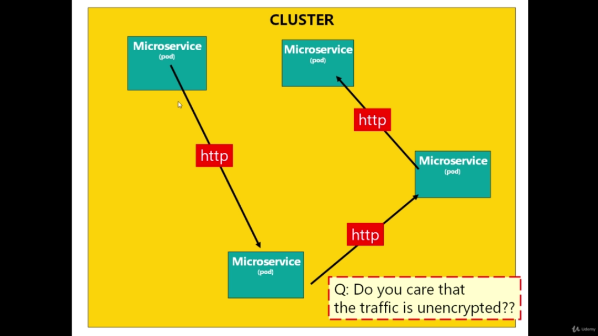
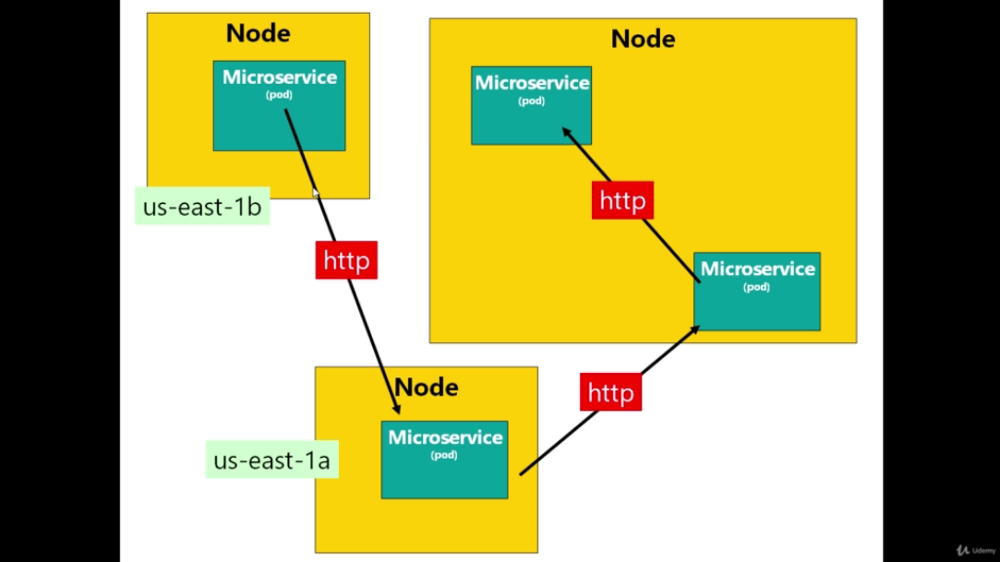
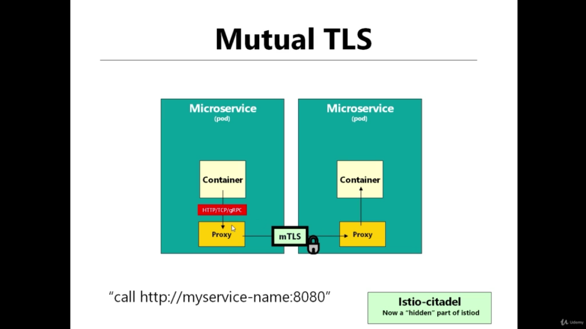
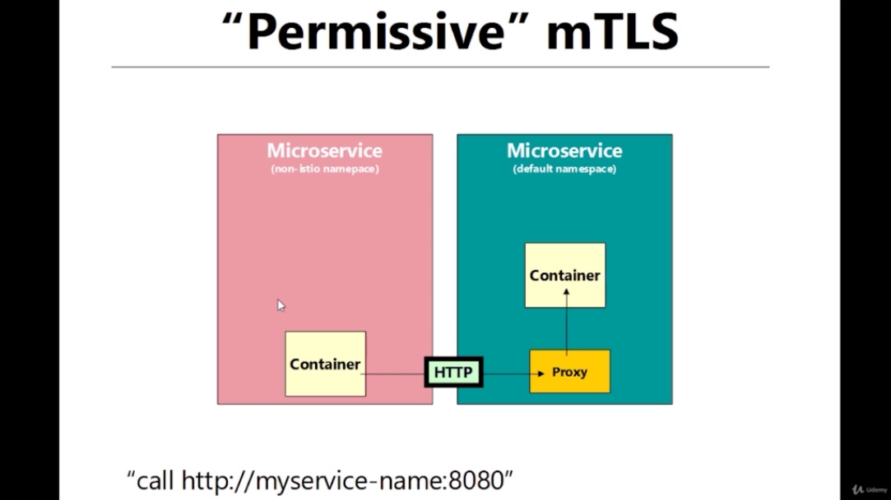
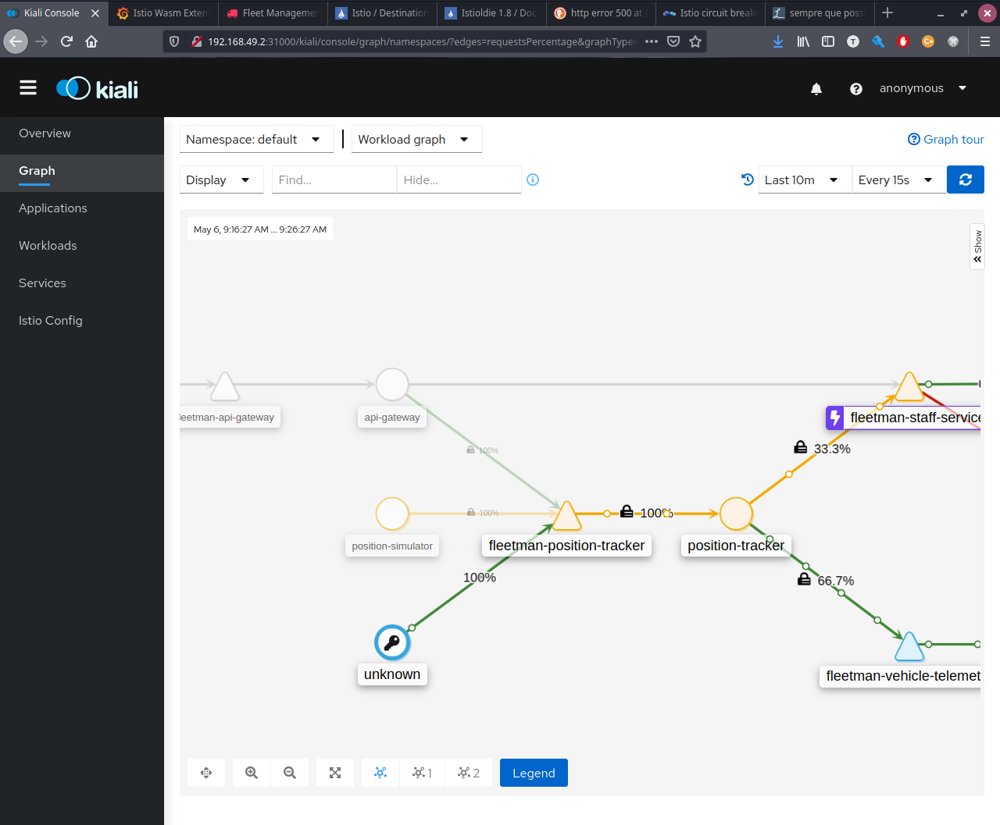
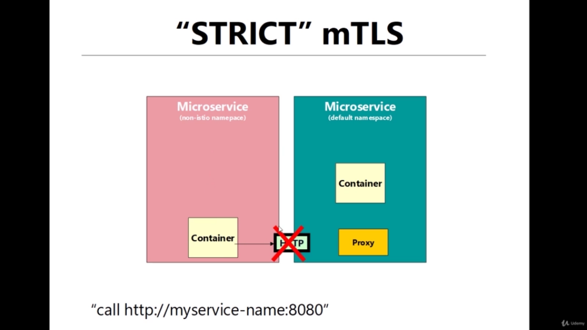

# Mutual TLS

By default on a Kubernets Cluster all traffic between the pods are unencrypted.



In the case of a multi zone kubernets cluster, for sure the traffic between pods will leaving a building (datacenter) and gone through the world on a http request. What can be dangerous.



However one of the advantages of Istio is that it provides the mTLS. Securing the communication between pods.

.

So, the pod calls the proxy using HTTP and the proxy routes this request to another proxy that is in front of the pod that normally receives the request. However, the communication between the proxies uses `TLS` and both proxies validates the certificates from each other (`mTLS`), checking if the certificate was issued by Istio, the former `istio-citadel`.


## Enabling mTLS
---

And that is the good news! By default all traffic inside cluster using Istio is already mTLS! 

However, there are some configurations that it is possible to do, and one of them is `Permissive mTLS` vs `Strict mTLS`.

## Permissive mTLS
---



In the example above, one of the containers does not have a proxy ("was not deployed with Istio Injection"), and the other container has a proxy. In this case the container without a proxy makes a request to the container that have a proxy, however the proxy cannot automatically upgrade the request from http to https. And as default lets the request between the pods be performed using htts. So, this cenario is called `Permissive mTLS` - where is possible request will be made using mTLS

### `Let's Test it`

- `Open the Access of Position Tracker Service`

```yaml
apiVersion: v1
kind: Service
metadata:
  name: fleetman-position-tracker

spec:
  # This defines which pods are going to be represented by this Service
  # The service becomes a network endpoint for either other services
  # or maybe external users to connect to (eg browser)
  selector:
    app: position-tracker
  ports:
    - name: http
      port: 8080
      nodePort: 32001 # <-- Allows traffic from port 32001
  type: NodePort # <-- Opens Traffic from Node Port
``` 

- `Making An Unsecure Request From Localhost`
```bash
curl http://$(minikube ip):32001/vehicles/

# Answer 
# [{"name":"Village Truck","lat":53.2176010,"lng":-1.6967500,"timestamp":"2021-05-06T12:30:06.612+0000","speed":17.90250503501815696952},{"name":"London Riverside","lat":51.5105150,"lng":-0.0911230,"timestamp":"2021-05-06T12:30:01.385+0000","speed":4.39643973171538772312},{"name":"Huddersfield Truck A","lat":53.6088750,"lng":-1.8259580,"timestamp":"2021-05-06T12:30:10.966+0000","speed":28.7569799383890680384},{"name":"Huddersfield Truck B","lat":53.6240740,"lng":-1.8000420,"timestamp":"2021-05-06T12:30:04.952+0000","speed":5.13172565680310372200},{"name":"City Truck","lat":53.370797149837017059326171875,"lng":-1.49044194258749485015869140625,"timestamp":"2021-05-06T12:29:59.552+0000","speed":9.9365288279810076576}]
```



Note that in the figure above, the key symbol represents the unknown caller (in this case the localhost ip), and the connection between the `unknown entity` and the `fleetman-position-tracker` does not have the padlock. So the request used `HTTP` protocol.

## Strict mTLS
---



This situation is equals to the prior example, however the Istio is configured to just accept `Strict mTLS`. In other words, if a request performed on `http` could not be upgraded to `https` it will be `dropped`. No uncrypted communication is allowed! 

- `Enforcing mTLS`
```yaml
apiVersion: security.istio.io/v1beta1
kind: PeerAuthentication
metadata:
  name: default
  namespace: istio-system # <-- Applying on Istio Namespaces means that all namespaces will follow this policy
spec:
  mtls:
    mode: STRICT
```

- `Making An Unsecure Request From Localhost`
```bash
curl http://$(minikube ip):32001/vehicles/

# Answer
# curl: (56) Recv failure: Connection reset by peer
```

## References
---

- [`Istio Authentication (mTLS)`](https://istio.io/latest/docs/reference/config/security/peer_authentication/)