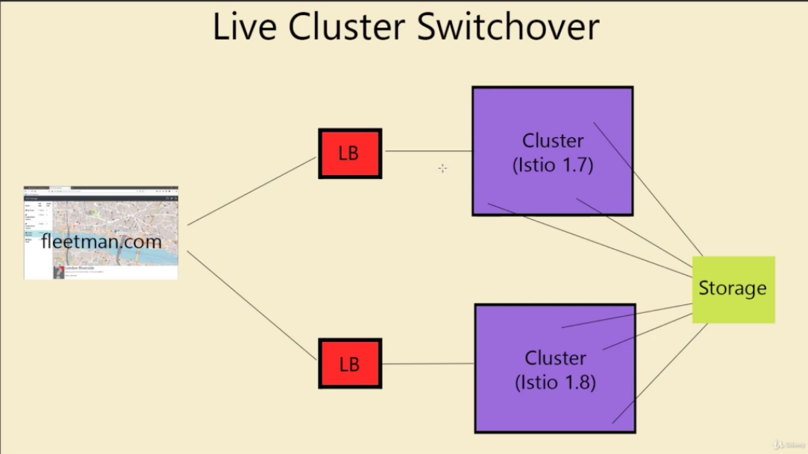

# Upgrading

Upgrading Istio is one of the most dangerous operations to perform, since istio is not just a pod or a deployment, istio is an entire infrastructure. As a result, upgrading istio results in downtimes.

## In-place Upgrades
---

In-place upgrades is the easiest way to update Istio, and it is possible to execute if just one command. However, it is extremely risky.

- `Installing Istio 1.8`
```bash
# istioclt8 = istio-1.8.5/bin/istioctl
istioctl8 install --set profile=demo
# installing Addons for Monitoring Purposes
kubectl apply -f ./data/8\ Customization/init-addons.yaml
kubectl apply -f ./data/8\ Customization/addons.yaml
```

- `Deploying Workloads`
```bash
kubectl apply -f ./data/7\ mTLS/4-label-default-namespace.yaml
kubectl apply -f ./data/7\ mTLS/5-application-no-istio.yaml
kubectl apply -f ./data/7\ mTLS/6-gateway.yaml
```

- `Upgrading In-Place`
```bash
# istioclt9 = istio-1.9.4/bin/istioctl
istioctl9 upgrade
```

- `After Upgrade` - After the upgrade it is necessary to restart the running pods to update the proxies inside them.
```bash
kubectl rollout restart deploy
```

## Canary Upgrade
---

This is the recommended way to upgrade.

- `Installing Istio 1.8`
```bash
# istioclt8 = istio-1.8.5/bin/istioctl
istioctl8 install --set profile=demo --set revision=1-8
# installing Addons for Monitoring Purposes
kubectl apply -f ./data/8\ Customization/init-addons.yaml
kubectl apply -f ./data/8\ Customization/addons.yaml
```

- `Deploying Workloads`

On these deploys there is a customization on the istio side car injection. Since istio was installed with the value `--set revision=1.8`. The sidecar just will be inject on namespace with the label `istio.io/rev=1-8`. So it is necessary to deploy this yaml in the namespace.

```yaml
apiVersion: v1
kind: Namespace
metadata:
  labels:
    istio.io/rev: 1-8
  name: default
```

```bash
kubectl apply -f ./data/9\ Upgrading/2-application-no-istio.yaml
kubectl apply -f ./data/9\ Upgrading/3-gateway.yaml
```
- `Applying Canary Upgrade`
```bash
# istioclt9 = istio-1.9.4/bin/istioctl
istioctl9 install --set profile=demo --set revision=1-9
```

- `Apply New Namespace Labels`
```yaml
apiVersion: v1
kind: Namespace
metadata:
  labels:
    istio.io/rev: 1-9
  name: default
```

- `After Upgrade` - After the upgrade it is necessary to restart the running pods to update the proxies inside them.
```bash
kubectl rollout restart deploy
```

- `Delete the Old Istiod`
```bash
istioctl8 x uninstall --revision=1-8
```

## The Best Practice to Update Istio
---

Althrough Istio documentation recommends using Istio Canary Upgrade on the task of upgrading Istio Version, it still is a very risky operation.

So, the best practice to IAC Cluster that are stateless and have all deploys scripted or automatized is to create a new cluster and perform a `Cluster Switchover` using the DNS and loadbalancer.




